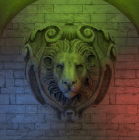
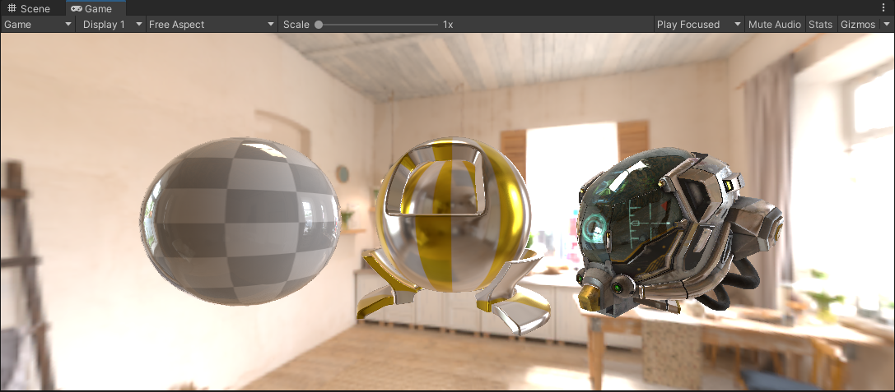
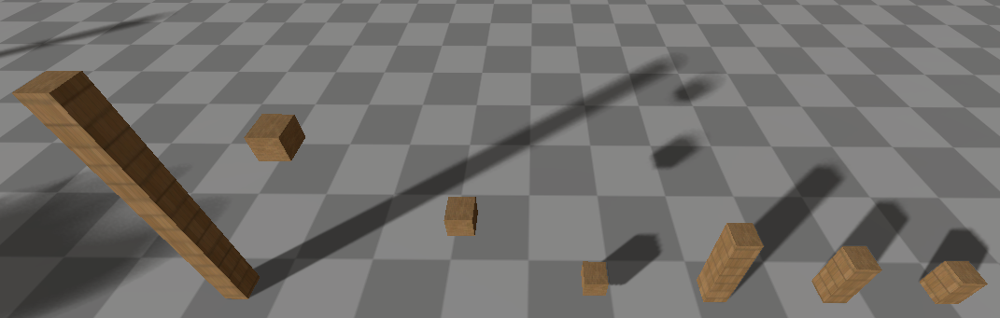
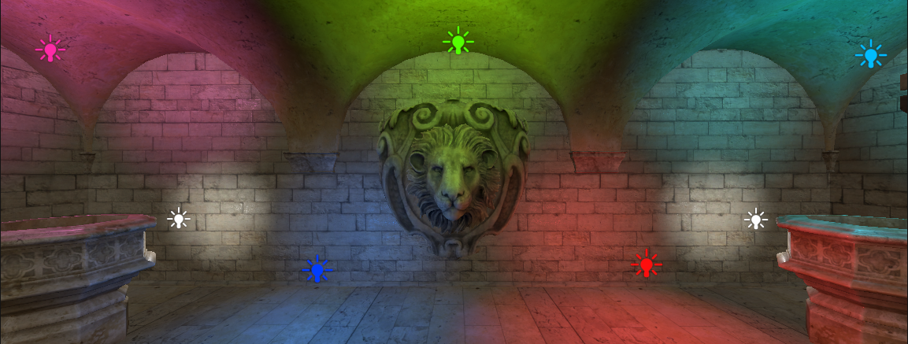
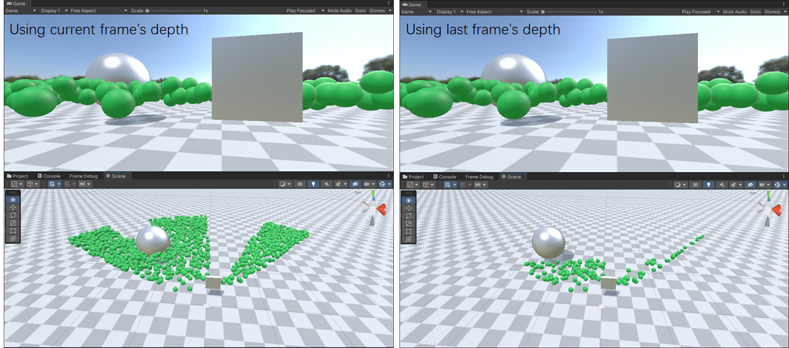
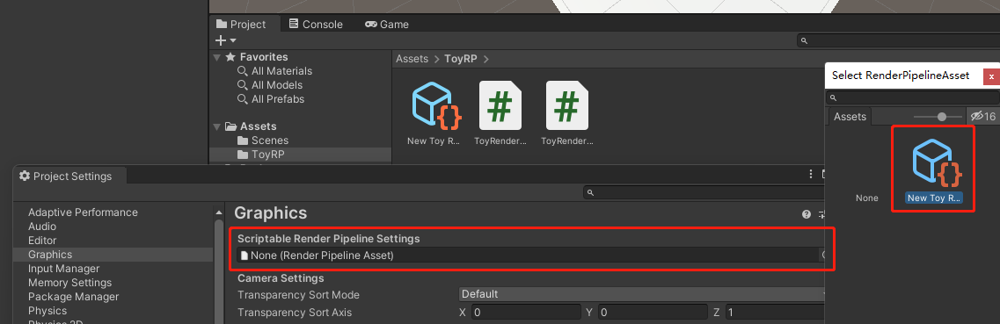
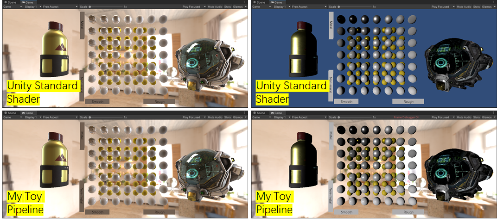

# ToyRenderPipeline

基于Unity SRP开发的延迟渲染管线，包括各种流行的图形功能

# 简介

基于物理的渲染（PBR）和基于图像的照明（IBL）：

级联阴影映射（CSM）和软阴影（PCSS）：

Cluster Based Light：

 使用compute shader的GPU Based（frustum& Hi-Z occlusion）Culling：

# 特点

* 延迟着色管线
* 基于物理的渲染（PBR，direct light）
* 基于图像的照明（IBL，ambient light）
* 级联阴影贴图（CSM）
* PCSS 软阴影
* Cluster Based Deferred Lighting
* GPU Based Culling（Frustum & Occlusion）

# 环境

* Unity 2021.2，win 11，DX 11
* 支持MRT的 GPU

# 使用

* 菜单 `Create > RenderPipeline > ToyRenderPipeline`，创建实际管线资产。
* 菜单 `Edit > Project Settings > Graphics`，选择custom pipeline。
* 将 `ToyRP/gbuffer` shader 绑定到所有材质。

# 同Unity的对比

使用一些技巧试图将渲染结果与Unity中的内置管线对齐，左列为IBL效果，而右侧为方向灯

# 
